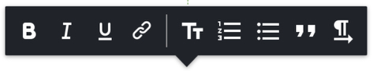

# Toolbar Customization

## Motivation

As it turns out, various `RichContentEditor` consumers have different customization needs. On other hand, it is important to keep the public API clean, while providing the desired customability. In order to meet these requirements, the `RichContentEditor` exposes `config` object prop.

This document focuses on a specific `config` API `getToolbarSettings` that is responsible for the toolbar customization.

## `getToolbarSettings` API

### Signature

The `getToolbarSettings` is defined as follows: `{ textButtons, pluginButtons, pluginTextButtons } => Array<Setting>`


The `textButtons` and `pluginTextButtons` parameters are objects of the following structure:

```javascript
{
  mobile: {
    buttonName: buttonComponent,
    ...
  },
  desktop: {
    buttonName: buttonComponent,
    ...
  }
}
```

The `pluginButtons` parameter is an `inline-button` data array (see divider plugin [inline-buttons](../packages/plugin-divider/src/toolbar/inline-buttons.jsx) for reference).

The `Setting` type is defined as follows:

```javascript
{
  name: TOOLBARS.TYPE,
  shouldCreate: () => {
    desktop: boolean,
    mobile: {
      ios: boolean,
      android: boolean
    }
  },
  getVisibilityFn: () => {
    desktop: editorState => boolean,
    mobile: {
      ios: editorState => boolean,
      android: editorState => boolean
    }
  },
  getPositionOffset: () => {
    desktop: { x: number, y: number },
    mobile: {
      ios: { x: number, y: number },
      android: { x: number, y: number }
    }
  },
  getDisplayOptions: () => {
    desktop: { displayMode: DISPLAY_MODE.NORMAL | DISPLAY_MODE.FLOATING },
    mobile: {
      ios: { displayMode: DISPLAY_MODE.NORMAL | DISPLAY_MODE.FLOATING },
      android: { displayMode: DISPLAY_MODE.NORMAL | DISPLAY_MODE.FLOATING },
    }
  },
  getToolbarDecorationFn: () => {
    desktop: () => Component,
    mobile: {
      ios: () => Component,
      android: () => Component,
    }
  },
  getButtons: () => {
    desktop: Array<Component> | Array<string>,
    mobile: {
      ios: Array<Component> | Array<string>,
      android: Array<Component> | Array<string>
    }
  },
   getTextPluginButtons: () => {
    desktop: Map<Component>,
    mobile: {
      ios: Map<Component>,
      android: Map<Component>
    }
  }
}
```

As you can see, the `Settings` is form-factor aware, i.e. it defines different behaviors for desktop/mobile views.

### Toolbar types

The following toolbar types are available:

- Text editing toolbars:
  - Static text toolbar
  - Inline text toolbar
  - Mobile toolbar
- Plugin insertion toolbars:
  - Side toolbar
  - Footer toolbar
- Plugin functionality toolbars

All the toolbar types are exposed by the `TOOLBARS` const found in [consts.js](https://github.com/wix-incubator/rich-content/blob/master/packages/common/src/consts.js).

### `Settings` properties

| property                 | description                                                                                                                                                                                                                                                                     | affected toolbars                           |
| ------------------------ | ------------------------------------------------------------------------------------------------------------------------------------------------------------------------------------------------------------------------------------------------------------------------------- | ------------------------------------------- |
| `name`                   | one of the toolbar types (see `TOOLBARS` const for details)                                                                                                                                                                                                                     | all                                         |
| `shouldCreate`           | determines whether the toolbar should be created at the first place                                                                                                                                                                                                             | all                                         |
| `getVisibilityFn`        | toolbar visibility function                                                                                                                                                                                                                                                     | all                                         |
| `getPositionOffset`      | toolbar offset point in pixels, relatively to the default toolbar position                                                                                                                                                                                                      | all                                         |
| `getDisplayOptions`      | toolbar display options (see next section for details)                                                                                                                                                                                                                          | all                                         |
| `getToolbarDecorationFn` | component to be rendered instead of default toolbar container (see the following sections for details)                                                                                                                                                                          | all                                         |
| `getButtons` (1)         | a list of the toolbar button components                                                                                                                                                                                                                                         | plugin insertion and functionality toolbars |
| `getButtons` (2)         | a list of inline button names                                                                                                                                                                                                                                                   | text editing toolbars                       |
| `getTextPluginButtons`   | a map of inline buttons added by plugins. The keys are derived from the `PluginTextButtonMappers` -- see the `link-plugin`'s [createLinkToolbar](https://github.com/wix-incubator/rich-content/blob/master/packages/plugin-link/src/toolbar/createLinkToolbar.js) for reference | text editing toolbars                       |

#### Display Options

At the moment, the `getDisplayOptions` API consists of a single property `displayMode`. This property accepts two values (defined in [consts.js](https://github.com/wix-incubator/rich-content/blob/master/packages/common/src/consts.js)):

- `DISPLAY_MODE.NORMAL` is the default; the toolbars are normally-positioned
- `DISPLAY_MODE.FLOATING` the toolbars are in fixed position. This, combined with `getVisibilityFn` and `getPositionOffset` properties, causes toolbars to "float".

**Note**: while in `DISPLAY_MODE.FLOATING` mode, the `getPositionOffset` property denotes absolute screen coordinates.

#### Toolbar Decoration

Sometimes, a static theme is not enough. For example, consider the case when the inline toolbar is required to display a "chevron" right above the selected text.



Such behavior involves multiple dynamic values to be calculated within toolbar rendering.

So, the `getToolbarDecorationFn` comes to rescue. This function is expected to return a `Component` to be rendered instead of the default toolbar container. This `Component` will be provided with the toolbar container props. For reference, check out the [InlineToolbarDecoration.jsx](../examples/editor/src/InlineToolbarDecoration.jsx)

## Plugin functionality toolbar customization

The `getButtons` property, when applied on `TOOLBARS.PLUGIN`, will affect ALL the plugin functionality toolbars. This can be used, for example, to hide size-related buttons for *all* the plugin toolbars.

In order to hide a specific button in a specific plugin toolbar, please use the `config.`*`plugin_type_name`*.`toolbar.hidden` property. For example, to hide the `Replace` button of the `video-plugin` toobar, the following `config` should be provided to the `RichContentEditor`:

```javascript
const config = {
  [VIDEO_TYPE]: {
    toolbar: {
      hidden: ['replace']
    }
  }
};
```

The `hidden` value is expected to be a string array, where every string is the plugin toolbar button `keyName`.

## References and examples

The [default-toolbar-settings.js](https://github.com/wix-incubator/rich-content/blob/master/packages/editor/src/RichContentEditor/Toolbars/default-toolbar-settings.js) contains the default toolbar settings, and the `getToolbarSettings` code example could be found in [PluginConfig.js](https://github.com/wix-incubator/rich-content/blob/master/examples/editor/src/PluginConfig.js) (commented by default).
